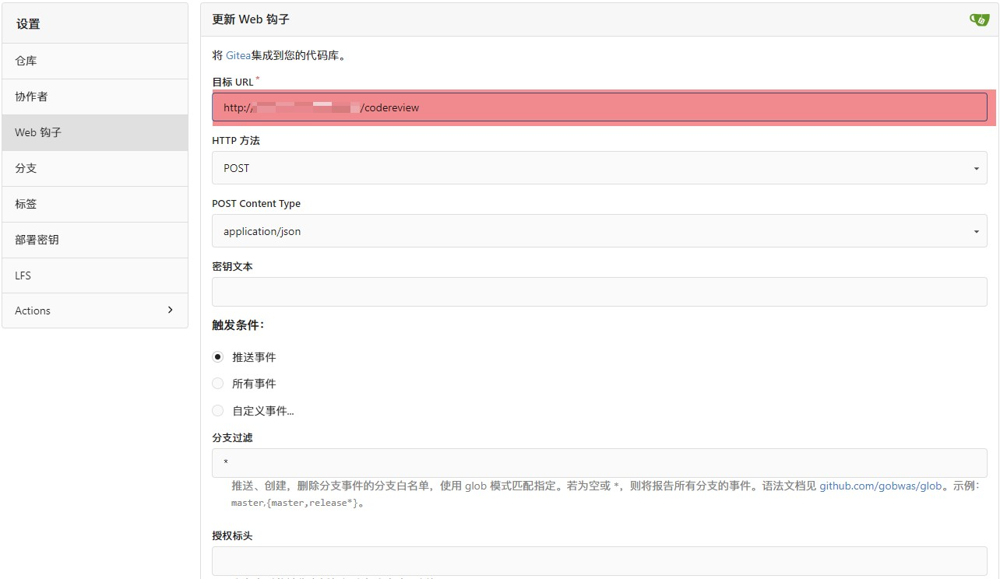

# GITEA-AI-CODEVIEW

本项目是 hack Github Copilot 的 api,获取代码提交的 `diff` 信息，提交给 Copilot 审查，然后创建到 Gitea issue 上。

## 环境变量

| 环境变量名           | 描述                       | 默认值                                      |
| -------------------- | -------------------------- | ------------------------------------------- |
| GITEA_TOKEN          | 用于访问 Gitea API 的令牌  | 无                                          |
| OPENAI_KEY           | 用于访问 OpenAI API 的密钥 | 无                                          |
| COPILOT_TOKEN        | 用于访问 Copilot 的密钥    | 无                                          |
| GITEA_HOST           | Gitea 服务器的主机地址     | 无                                          |
| IGNORED_FILE_SUFFIX  | 忽略的文件后缀             | 无                                          |
| WEBHOOK_URL          | web hook url               | 无                                          |
| WEBHOOK_HEADER_NAME  | web hook 请求头字段名      | 无                                          |
| WEBHOOK_HEADER_VALUE | web hook 请求头字段内容    | 无                                          |
| WEBHOOK_REQUEST_BODY | web hook 请求体 json       | 占位符为 content 消息正文，mention 提到的人 |

## 开发

```shell

copy .env.example .env # 创建配置文件 获取 Gitea 仓库的 `access_token`， `host` 以及 Copilot `COPILOT_TOKEN` 配置到 `.env` 文件中。
python -m venv .venv && ./venv/Scripts/activate # 创建虚拟环境并激活
pip install -r requirements.txt || poetry install # 安装依赖，如果安装了 poetry 建议使用 poetry 命令
python main.py # 运行
访问 http://127.0.0.1:3008/docs

```

## 配置 webhook

-   http://{server_host}:{server_port}/codereview



# Tip

如果提交信息包含 `[skip codereview]` 将跳过代码审查

`WEBHOOK_REQUEST_BODY` 最外层括号要转义，`{...}` -> `{{...}}`
